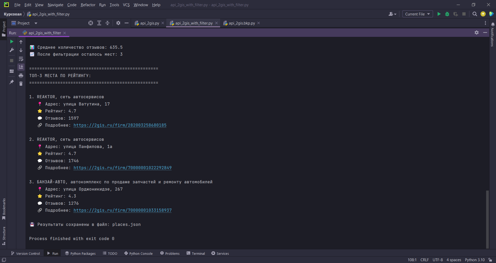

# Курсовая работа
3 семестр

Выполнила студентка группы ПИН-232 Корноухова Маргарита.

Парсинг API 2gis. Поиск мест, их адреса, рейтинга и количества отзывов. Поиск топ-3 места по запросу. Сохранение десяти найденных мест в json-файл.

